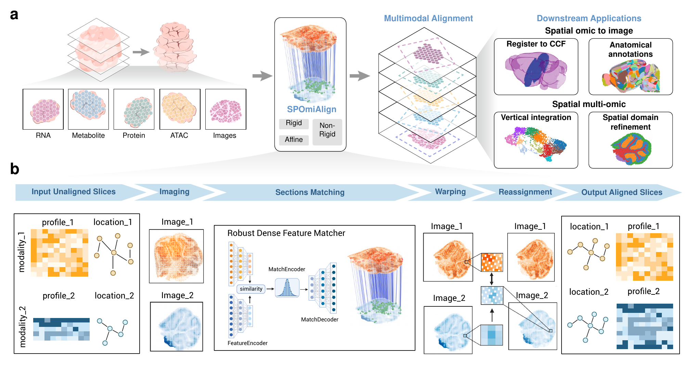

# SPOmiAlign: a modality-agnostic framework for multimodal spatial omics alignment

`SPOmiAlign` is a computational framework for multimodal spatial omics alignment enabled by a feature matching foundation model.

Corresponding manuscript title:
`SPOmiAlign: A modality-agnostic computational framework for multimodal spatial omics alignment enabled by a feature matching foundation model`



## Directory structure

```text
.
├── SPOmiAlign/              # Core Python modules for rasterization, alignment, and reassignment
├── demo/                    # Example notebooks and runnable Python demos
├── docs/                    # Repository documentation and README assets
├── env/                     # Conda environment specification
├── images/                  # Original manuscript figures
├── resource/                # Standalone utility scripts for h5ad post-processing
├── software/                # Bundled third-party dependencies used by the pipeline
└── README.md
```

## Workflow overview

`SPOmiAlign` supports image-to-image and h5ad-to-h5ad alignment workflows:

1. Convert spatial omics coordinates or intensity-aware spots into rasterized images.
2. Use the RoMa-based feature matching pipeline to estimate cross-modality alignment.
3. Warp source coordinates or aligned h5ad objects into the reference coordinate system.
4. Reassign source expression profiles onto the aligned spatial layout for downstream analysis.

The overview figure used in this README is generated from [`images/figure_1.pdf`](images/figure_1.pdf). The repository organization and README presentation are adapted with reference to [`gao-lab/SLAT`](https://github.com/gao-lab/SLAT).

## Installation

We recommend creating a dedicated conda environment first:

```bash
conda env create -f env/SPOmiAlign.yml
conda activate SPOmiAlign
```

Some workflows also rely on the bundled third-party code under `software/`, especially the RoMa-related components.

## Quick start

Representative entry points are:

- `demo/python/S1S2.py`: image-to-image alignment example.
- `demo/python/sm2st.py`: h5ad-to-h5ad alignment and reassignment example.
- `demo/notebook/`: notebook-based reproductions for multiple case studies.
- `resource/align_h5ad.py`: write transformed coordinates back into `obsm["spatial"]`.
- `resource/reassignment.py`: standalone reassignment utilities.

## Repository notes

- Core alignment code lives in [`SPOmiAlign/roma.py`](SPOmiAlign/roma.py).
- H5AD rasterization and preprocessing utilities live in [`SPOmiAlign/data_preprocessing.py`](SPOmiAlign/data_preprocessing.py).
- Packaged reassignment logic lives in [`SPOmiAlign/reassignment.py`](SPOmiAlign/reassignment.py).
- The README pipeline asset is stored in [`docs/_static/pipeline.png`](docs/_static/pipeline.png).

## Citation

If you use this repository, please cite the SPOmiAlign manuscript:

```text
SPOmiAlign: A modality-agnostic computational framework for multimodal spatial omics alignment enabled by a feature matching foundation model
```
