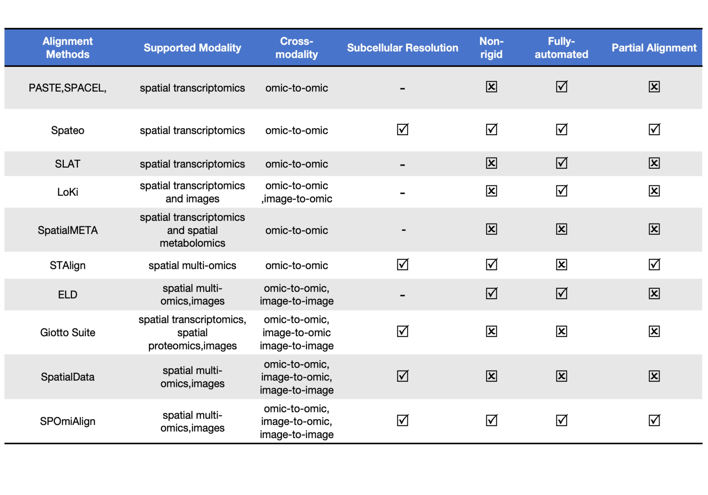

# SPOmiAlign: a modality-agnostic framework for multimodal spatial omics alignment

`SPOmiAlign` is a computational framework for multimodal spatial omics alignment enabled by a feature matching foundation model.

Corresponding manuscript title:
`SPOmiAlign: A modality-agnostic computational framework for multimodal spatial omics alignment enabled by a feature matching foundation model`




The comparison figure is placed directly below Fig. 1 to summarize where `SPOmiAlign` sits relative to representative spatial alignment methods. It highlights the method's support for cross-modality registration, subcellular-resolution use cases, non-rigid alignment, fully automated execution, and partial-alignment scenarios. Together with the pipeline overview above, this table gives a quick visual summary of both the workflow and the practical scope of the framework.

## Directory structure

```text
.
|- SPOmiAlign/              # Core Python modules for rasterization, alignment, and reassignment
|- demo/                    # Example notebooks and runnable Python demos
|- docs/                    # Repository documentation assets
|- env/                     # Conda environment specification
|- images/                  # Manuscript figures
|- resource/                # Standalone helper scripts
|- software/                # Bundled third-party dependencies used by the pipeline
`- README.md
```

## Workflow overview

`SPOmiAlign` supports two common workflows:

1. Image-to-image alignment
   Input: a fixed reference image and a moving source image.
   Output: a warped source image, match visualization, and overlay plots.
2. H5AD-to-H5AD alignment
   Input: a fixed reference `h5ad` and a moving source `h5ad`.
   Output: rendered SSI-like images, a transformed source `h5ad`, aligned coordinates, and visual validation files.

The typical pipeline is:

1. Read spatial coordinates from `obsm["spatial"]` or from coordinate columns in `obs`.
2. Render point clouds or SSI-like images for matching.
3. Run the RoMa-based alignment engine to estimate the transform.
4. Warp the source image and, when applicable, the source coordinates.
5. Save aligned coordinates and transformed `h5ad` files for downstream analysis.
6. Optionally run reassignment to transfer low-resolution expression to the aligned high-resolution layout.

## Installation

We recommend creating a dedicated conda environment first:

```bash
conda env create -f env/SPOmiAlign.yml
conda activate SPOmiAlign
```

After the environment packages are installed, install the bundled third-party code in this order:

```bash
cd software/fused-local-corr-master/fused-local-corr-master
pip install -e .

cd ../../Roma
pip install -e .

cd ../..
```

Some workflows rely on these local `software/` components, especially the RoMa-related code.

## Before you run anything

### Input requirements for `h5ad` workflows

For most `h5ad`-based pipelines, each input file should satisfy one of the following:

- `adata.obsm["spatial"]` exists and stores coordinates in shape `(n_obs, 2)` or `(n_obs, >=2)`.
- Or, coordinate columns exist in `adata.obs`, for example `x/y`, `X/Y`, `Raw_Slideseq_X/Raw_Slideseq_Y`, or other explicitly provided column pairs.

Recommended conventions:

- `obs["id"]` is optional but useful. If absent, `obs_names` will be used as spot IDs.
- Keep coordinates in the same physical frame within each file before alignment.
- Make sure the source and target files are not empty and contain finite coordinates.

### Minimal folder layout for demo-style SM-to-ST alignment

If you want to run the demo-style SM-to-ST scripts directly, organize the inputs like this:

```text
demo/SPOmiAlign_Repro/output_h5ad/
|- R114/
|  |- st.h5ad
|  `- sm.h5ad
|- S15/
|  |- st.h5ad
|  `- sm.h5ad
`- ...
```

## Quick start

### 1. Generic `h5ad` to `h5ad` alignment

Use [`SPOmiAlign/align_h5ad_to_h5ad_square.py`](SPOmiAlign/align_h5ad_to_h5ad_square.py) when you have two arbitrary `h5ad` files and want the most flexible command-line interface.

```bash
python SPOmiAlign/align_h5ad_to_h5ad_square.py \
  --target-h5ad path/to/reference_st.h5ad \
  --source-h5ad path/to/moving_sm.h5ad \
  --output-dir output/h5ad_to_h5ad_square \
  --sample-id example_pair \
  --method affine+bspline
```

Default behavior:

- The target is treated as the fixed/reference slice.
- The source is treated as the moving slice to be aligned.
- Coordinates are read from `obsm["spatial"]` by default.
- If `obsm["spatial"]` is missing, the script will try common coordinate column pairs in `obs`.

Useful optional arguments:

- `--target-spatial-key` and `--source-spatial-key`: use a non-default key instead of `obsm["spatial"]`.
- `--target-x-obs-col`, `--target-y-obs-col`, `--source-x-obs-col`, `--source-y-obs-col`: explicitly use `obs` columns as coordinates.
- `--target-rotate` and `--source-rotate`: apply pre-rotation before alignment.
- `--target-flip-horizontal` and `--source-flip-horizontal`: apply horizontal flips before alignment.
- `--target-render-mode` and `--source-render-mode`: choose between `scatter` and `raster`.
- `--target-display-long-side` and `--source-display-long-side`: control rendered canvas scale.
- `--method`: choose `Affine`, `Homography`, `bspline`, or `affine+bspline`.

### 2. Manuscript-style SM-to-ST batch alignment

Use the manuscript-style demo scripts when your data already follows the sample-folder layout shown above.

```bash
python demo/python/R114.py
python demo/python/sm2st.py
```

These scripts expect, for each sample:

- `st.h5ad`: the fixed/reference ST slice
- `sm.h5ad`: the moving/source SM slice

### 3. Image-to-image alignment

Use the image-to-image demo scripts for plain image registration.

```bash
python demo/python/S1toS2.py
python demo/python/092_to_Puck57.py
```

## Case-study scripts and notebooks

The repository already includes manuscript-matched example scripts and notebooks under `demo/`:

- `demo/python/R114.py`
- `demo/python/PUCK29.py`
- `demo/python/PUCK43.py`
- `demo/python/sm2st.py`
- `demo/notebook/`

These are useful as worked examples for the case studies reported in the manuscript. In practice:

- use `SPOmiAlign/align_h5ad_to_h5ad_square.py` when you want a stable command-line workflow for arbitrary `h5ad` pairs;
- use the `demo/python/*.py` or notebooks when you want to inspect a full end-to-end example step by step.

## What the output folders contain

For `h5ad`-based alignment, the output directory typically contains three subfolders:

### `render/`

Common files:

- `st_scatter.png` or target render image
- `sm_scatter_rot_ccw90.png` or source render image
- `st_render_meta.json`, `sm_render_meta.json`
- `st_render_style.json`, `sm_render_style.json` for the generic `h5ad` workflow

These files let you verify what was actually rendered before matching.

### `ssi/`

Produced by the generic `align_h5ad_to_h5ad_square.py` workflow. This folder contains SSI-related intermediate outputs and summaries for the target and source images.

### `alignment/`

Common files:

- `transformed.h5ad`: source `h5ad` after coordinates have been mapped into the target frame
- `st_original_coords.csv`: original target coordinates exported as CSV
- `sm_aligned_coords.csv`: aligned source coordinates exported as CSV
- `transformed_sm_scatter_for_check.png`: transformed source rendered in target space for validation
- `sm_transformed_vs_st_overlay.png`: overlay visualization for quick visual inspection
- `1_matches_color_coded.jpg`: RoMa keypoint matches
- `2_alignment_compare.jpg`: side-by-side comparison
- `3_alignment_overlay.jpg`: target plus warped source overlay
- `alignment_timing.json`: runtime summary for the generic `h5ad` workflow

## How to choose key parameters

### Alignment method

- `Affine`: fast and simple; good for mild global deformation.
- `Homography`: useful when the dominant difference is projective.
- `bspline`: non-rigid warping without an affine pre-step.
- `affine+bspline`: usually the safest starting point for cross-modality spatial omics alignment.

### Rendering scale

- Increase `display-long-side` if the rendered spot structure looks too coarse.
- Use `padding > 0` when tissue boundaries are clipped too tightly.
- If rendered images already have the correct native extent, set `display-long-side` to `0`.

### Coordinates

- If `obsm["spatial"]` already stores the correct coordinates, keep the defaults.
- If your coordinates live in `obs`, explicitly pass `--*-x-obs-col` and `--*-y-obs-col`.
- If the target and source orientations differ strongly, start by adjusting `--source-rotate`.

### Rendering mode

- `scatter` is recommended for spot-based data and is the default in most manuscript-style scripts.
- `raster` is useful when intensity-aware rendering is important and you want a denser SSI-like image.

## Downstream analysis: how to use the results

### 1. Load the transformed source `h5ad`

After alignment, the most important file is usually `alignment/transformed.h5ad`.

```python
import scanpy as sc

adata_aligned = sc.read_h5ad("path/to/alignment/transformed.h5ad")
print(adata_aligned)
print(adata_aligned.obsm["spatial"][:5])
```

This file can be used directly in downstream `Scanpy` workflows because the aligned coordinates are written back to the source object.

### 2. Use the exported coordinate CSVs in other pipelines

If you prefer working outside `AnnData`, use:

- `st_original_coords.csv`
- `sm_aligned_coords.csv`

These files can be merged with external metadata tables by spot ID and then imported into downstream multi-omics or visualization pipelines.

### 3. Run reassignment for expression transfer

Reassignment utilities are provided in:

- [`SPOmiAlign/reassignment.py`](SPOmiAlign/reassignment.py)
- [`resource/reassignment.py`](resource/reassignment.py)

The reassignment module uses nearest-neighbor mapping between aligned coordinates to transfer low-resolution expression to the high-resolution spatial layout.

Typical downstream use cases:

- build a reassigned `h5ad` for integrated expression analysis;
- plot transferred expression on the aligned coordinate system;
- use the new object in `Scanpy` or export matrices/tables for Seurat or custom pipelines.

### 4. Write coordinates back into an existing `h5ad`

If you only have transformed coordinates as a CSV and want to inject them into an existing `h5ad`, see:

- [`resource/align_h5ad.py`](resource/align_h5ad.py)

This helper script writes transformed coordinates back into `obsm["spatial"]`.

## Recommended end-to-end usage pattern

For external users, we recommend the following order:

1. Confirm that both input files contain valid coordinates.
2. Run `align_h5ad_to_h5ad_square.py` or `align_sm_to_st_square.py`.
3. Check `render/` and `alignment/sm_transformed_vs_st_overlay.png` to confirm the match visually.
4. Load `alignment/transformed.h5ad` in `Scanpy` or your preferred analysis pipeline.
5. If needed, run reassignment to transfer expression across resolutions/modalities.
6. Use the reassigned object or aligned coordinates in downstream clustering, annotation, visualization, or multi-omics integration workflows.

## Repository notes

- Core alignment code lives in [`SPOmiAlign/roma.py`](SPOmiAlign/roma.py).
- H5AD rasterization and preprocessing utilities live in [`SPOmiAlign/data_preprocessing.py`](SPOmiAlign/data_preprocessing.py).
- Packaged reassignment logic lives in [`SPOmiAlign/reassignment.py`](SPOmiAlign/reassignment.py).
- The README pipeline asset is stored in [`docs/_static/pipeline.png`](docs/_static/pipeline.png).

## Citation

If you use this repository, please cite the SPOmiAlign manuscript:

```text
SPOmiAlign: A modality-agnostic computational framework for multimodal spatial omics alignment enabled by a feature matching foundation model
```
