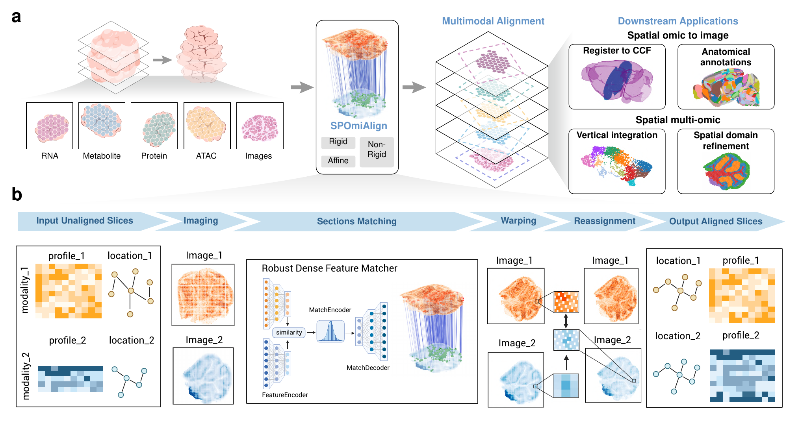

# SPOmiAlign: a modality-agnostic framework for multimodal spatial omics alignment

`SPOmiAlign` is a computational framework for aligning multimodal spatial omics data.

## Pipeline



## Directory structure

```text
SPOmiAlign-main/
|- SPOmiAlign/                 Core alignment and reassignment modules
|  `- software/                Bundled local dependencies
|     |- Roma/
|     `- fused-local-corr-master/
|- Tutorial/                   Tutorial notebooks and scripts
|  |- spatial transcriptomics to CCF/
|  |- multimodal spatial transcriptomic/
|  |- spatial multi-omics alignment without paired images/
|  `- spatial multi-omics alignment with paired images/
|- docs/
|  `- _static/pipeline.png     Pipeline figure
|- env/
|  `- SPOmiAlign.yml           Conda environment file
|- readme images/              Additional figures
|- resource/                   Helper scripts and resources
`- README.md
```

## Installation

Create and activate the conda environment:

```bash
conda env create -f env/SPOmiAlign.yml
conda activate SPOmiAlign
```

Install the bundled local dependencies:

```bash
cd SPOmiAlign/software/fused-local-corr-master/fused-local-corr-master
pip install -e .

cd ../../Roma
pip install -e .

cd ../../..
```

SpatialGlue-related requirements used by the tutorial data processing workflow, following the [SpatialGlue requirements](https://github.com/JinmiaoChenLab/SpatialGlue):

| Package | Version |
| --- | --- |
| Python | 3.8 |
| torch | >= 1.8.0 |
| cudnn | >= 10.2 |
| numpy | 1.22.3 |
| scanpy | 1.9.1 |
| anndata | 0.8.0 |
| rpy2 | 3.4.1 |
| pandas | 1.4.2 |
| scipy | 1.8.1 |
| scikit-learn | 1.1.1 |
| scikit-misc | 0.2.0 |
| tqdm | 4.64.0 |
| matplotlib | 3.4.2 |
| R | 4.0.3 |

## Tutorial

### Tutorial 1: omic-to-image (spatial transcriptomics to CCF)

- [Slide-seq_43 to Allen Brain Atlas](Tutorial/spatial%20transcriptomics%20to%20CCF/Slide-seq_43%20to%20Allen%20Brain%20Atlas.ipynb) 
- [Slide-seq_29 to Allen Brain Atlas](Tutorial/spatial%20transcriptomics%20to%20CCF/Slide-seq_29%20to%20Allen%20Brain%20Atlas.ipynb) 

### Tutorial 2: omic-to-omic (mouse brain multi-modal spatial transcriptomics alignment)

- [MERFISH to Slide-seq for half mouse brain](Tutorial/multimodal%20spatial%20transcriptomic/MERFISH%20to%20Slide-seq%20for%20half%20mouse%20brain.ipynb) 

### Tutorial 3: omic-to-omic (spatial multi-omics alignment without paired images)

- [ST and SM alignment for kidney sections](Tutorial/spatial%20multi-omics%20alignment%20without%20paired%20images/spatial%20multi-omics%20alignment%20for%20kidney%20sections.ipynb) 
- [ST and SM alignment for mouse brain sections](Tutorial/spatial%20multi-omics%20alignment%20without%20paired%20images/spatial%20multi-omics%20alignment%20for%20mouse%20brain%20sections.ipynb) 

### Tutorial 4: image-to-image (spatial multi-omics alignment with paired images)

- [Spatial multi-omics alignment with paired images](Tutorial/spatial%20multi-omics%20alignment%20with%20paired%20images/spatial%20multi-omics%20alignment%20with%20paired%20images.ipynb) 

## Data

Tutorial data are available from Google Drive:

https://drive.google.com/file/d/17j39rTAISwuH-kL3H0hnvzTG15Zo_xSK/view?usp=sharing
